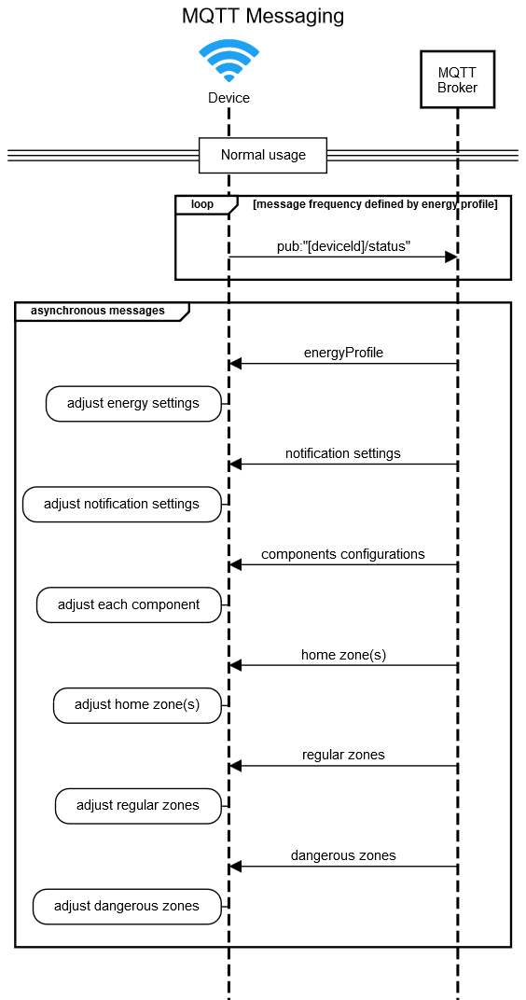

# Carelink Device MQTT Specifications
---

**This document aims to define the specifications of the MQTT control packets
("connect", "publish" and "subscribe"), to be used by the Carelink devices.**

NOTE: The specifications are meant to be device agnostic and thus some
considerations need to be observed, specifically in the standards and
nomenclature used, as well as in the interoperability of some variables and
features across different devices.

*Autor*: Jorge Calado (jsc\@uninova.pt)

*Document version*: 3.1.0 – 2019-08-06

Standards and nomenclature used
-------------------------------

>   DateTime timestamps using ISO8601 UTC extended format (e.g.
>   YYYY-MM-DDThh:mm:ssZ).

>   Location coordinates using the format WGS 84 (in Decimal Degrees).

>   Json notation for payload messages.

>   Geojson feature collection for definition of geographical areas.

Common Variables
----------------

| *Name*     | *Type* | *Description*                                        | *Required* |
|------------|--------|------------------------------------------------------|------------|
| [deviceId] | string | unique alphanumeric string for device identification | true       |

NOTICE: A user can have multiple devices. A device can only be associated with
one user at a time.

Connect Packet
==============

**Connect Flags:**

| Clean Session | false |
|---------------|-------|
| Will Qos      | 2     |
| Will Flag     | true  |
| Will Retain   | true  |
| Keep Alive    | 600   |

**Connect Payload:**

| Client Identifier | unique random mqtt identifier  |
|-------------------|--------------------------------|
| Will Topic        | "[deviceId]/status"            |
| Will Message      | "LW: Unexpected disconnection" |
| Username          | "deviceId"                     |
| Password          | "mqtt password"                |

MQTT Pub-Sub Topics Dendrogram
==============================

MQTT Messages Sequence Diagrams
===============================

### Device power-up

### Normal usage

### Fall/Wandering

(For supported devices only)

Publish Topics
==============

>   *"[deviceId]/status"*

>   *"[deviceId]/fall/confirmation"*

>   *"[deviceId]/fall/detected"*

>   *"[deviceId]/wandering/confirmation"*

>   *"[deviceId]/wandering/detected"*

"[deviceId]/status"
--------------------

| QoS    | 0     |
|--------|-------|
| Retain | false |

**(Single Status) Payload (compressed JsonObject):**  
    "{"timestamp":"YYYY-MM-DDThh:mm:ssZ","location":{"lat":float,"lon":float,"alt":float,"hdop":float,"vdop":float,"pdop":float},"batteryLevel":integer,"accompanied":boolean,"sensor":{"accelerometer":"x, y, z"}}"

| *Name*        | *Type*      | *Description*                                              | *Required* |
|---------------|-------------|------------------------------------------------------------|------------|
| timestamp     | string      | timestamp with the dateTime when data was recorded         | true       |
| location      | json object | json object with latitude, longitude, altitude coordinates | true       |
| lat           | float       | latitude coordinates                                       | true       |
| lon           | float       | longitude coordinates                                      | true       |
| alt           | float       | altitude coordinates                                       | true       |
| hdop          | float       | horizontal dilution of precision                           | false      |
| vdop          | float       | vertical dilution of precision                             | false      |
| pdop          | float       | positional dilution of precision                           | false      |
| batteryLevel  | integer     | value of battery level in mAh                              | true       |
| accompanied   | boolean     | indicator if device is paired with carer smartphone        | false      |
| sensor        | json object | json object with the sensors available on the device       | false      |
| accelerometer | string      | x, y, z axis acceleration values                           | false      |

**(Multi Status) Payload (compressed JsonObject):**  
    "{"timestamp":"YYYY-MM-DDThh:mm:ssZ","location":{"type":"MultiPoint","coordinates":[["lon","lat","alt"],…,["lon","lat","alt"]],"properties":[["hdop","vdop","pdop"],…,["hdop","vdop","pdop"]]},"batteryLevel":integer,"accompanied":boolean,"sensor":{"accelerometer":[["x","y","z"],…,["x","y","z"]]}}"

| *Name*        | *Type*         | *Description*                                        | *Required* |
|---------------|----------------|------------------------------------------------------|------------|
| timestamp     | string         | timestamp with the dateTime when data was recorded   | true       |
| location      | geojson object | geojson multipoint object                            | true       |
| lat           | float          | latitude coordinates                                 | true       |
| lon           | float          | longitude coordinates                                | true       |
| alt           | float          | altitude coordinates                                 | true       |
| hdop          | float          | horizontal dilution of precision                     | false      |
| vdop          | float          | vertical dilution of precision                       | false      |
| pdop          | float          | positional dilution of precision                     | false      |
| batteryLevel  | integer        | value of battery level in mAh                        | true       |
| accompanied   | boolean        | indicator if device is paired with carer smartphone  | false      |
| sensor        | json object    | json object with the sensors available on the device | false      |
| accelerometer | strings array  | x, y, z axis acceleration values                     | false      |
| x             | float          | x axis acceleration value                            |            |
| y             | float          | y axis acceleration value                            |            |
| z             | float          | z axis acceleration value                            |            |

"[deviceId]/fall/confirmation"
-------------------------------

| QoS    | 2     |
|--------|-------|
| Retain | false |

**Payload (compressed JsonObject):**  
    "{"status":boolean,"timestamp":"YYYY-MM-DDThh:mm:ssZ","location":{"lat":float,"lon":float,"alt":float},"batteryLevel":integer,"sensor":{"accelerometer":"x,y,z","heartrate":integer,"temperature":integer}}"

| *Name*        | *Type*      | *Description*                                              | *Required* |
|---------------|-------------|------------------------------------------------------------|------------|
| status        | boolean     | indicator if fall confirmation was positive or negative    | true       |
| timestamp     | string      | timestamp with the dateTime when data was recorded         | true       |
| location      | json object | json object with latitude, longitude, altitude coordinates | true       |
| lat           | float       | latitude coordinates                                       | true       |
| lon           | float       | longitude coordinates                                      | true       |
| alt           | float       | altitude coordinates                                       | true       |
| batteryLevel  | integer     | value of battery level in mAh                              | true       |
| sensor        | json object | json object with the sensors available on the device       | false      |
| accelerometer | string      | x, y, z axis acceleration values                           | false      |
| heartrate     | integer     | heart rate value in bpm                                    | false      |
| temperature   | integer     | Temperature value in degree Celsius                        | false      |

"[deviceId]/fall/detected"
---------------------------

| QoS    | 2     |
|--------|-------|
| Retain | false |

**Payload (compressed JsonObject):**  
    "{"timestamp":"YYYY-MM-DDThh:mm:ssZ","location":{"lat":float,"lon":float,"alt":float},"batteryLevel":integer,"sensor":{"accelerometer":"x,y,z","heartrate":integer,"temperature":integer}}"

| *Name*        | *Type*      | *Description*                                              | *Required* |
|---------------|-------------|------------------------------------------------------------|------------|
| timestamp     | string      | timestamp with the dateTime when data was recorded         | true       |
| location      | json object | json object with latitude, longitude, altitude coordinates | true       |
| lat           | float       | latitude coordinates                                       | true       |
| lon           | float       | longitude coordinates                                      | true       |
| alt           | float       | altitude coordinates                                       | true       |
| batteryLevel  | integer     | value of battery level in mAh                              | true       |
| sensor        | json object | json object with the sensors available on the device       | false      |
| accelerometer | string      | x, y, z axis acceleration values                           | false      |
| heartrate     | integer     | heart rate value in bpm                                    | false      |
| temperature   | integer     | Temperature value in degree Celsius                        | false      |

"[deviceId]/wandering/confirmation"
------------------------------------

| QoS    | 2     |
|--------|-------|
| Retain | false |

**Payload (compressed JsonObject):**  
    "{"status":boolean,"timestamp":"YYYY-MM-DDThh:mm:ssZ","location":{"lat":float,"lon":float,"alt":float},"batteryLevel":integer,"sensor":{"accelerometer":"x,y,z","heartrate":integer,"temperature":integer}}"

| *Name*        | *Type*      | *Description*                                                | *Required* |
|---------------|-------------|--------------------------------------------------------------|------------|
| status        | boolean     | indicator if wandering confirmation was positive or negative | true       |
| timestamp     | string      | timestamp with the dateTime when data was recorded           | true       |
| location      | json object | json object with latitude, longitude, altitude coordinates   | true       |
| lat           | float       | latitude coordinates                                         | true       |
| lon           | float       | longitude coordinates                                        | true       |
| alt           | float       | altitude coordinates                                         | true       |
| batteryLevel  | integer     | value of battery level in mAh                                | true       |
| sensor        | json object | json object with the sensors available on the device         | false      |
| accelerometer | string      | x, y, z axis acceleration values                             | false      |
| heartrate     | integer     | heart rate value in bpm                                      | false      |
| temperature   | integer     | Temperature value in degree Celsius                          | false      |

"[deviceId]/wandering/detected"
--------------------------------

| QoS    | 2     |
|--------|-------|
| Retain | false |

**Payload (compressed JsonObject):**  
    "{"timestamp":"YYYY-MM-DDThh:mm:ssZ","location":{"lat":float,"lon":float,"alt":float},"batteryLevel":integer,"sensor":{"accelerometer":"x,y,z","heartrate":integer,"temperature":integer}}"

| *Name*        | *Type*      | *Description*                                              | *Required* |
|---------------|-------------|------------------------------------------------------------|------------|
| timestamp     | string      | timestamp with the dateTime when data was recorded         | true       |
| location      | json object | json object with latitude, longitude, altitude coordinates | true       |
| lat           | float       | latitude coordinates                                       | true       |
| lon           | float       | longitude coordinates                                      | true       |
| alt           | float       | altitude coordinates                                       | true       |
| batteryLevel  | integer     | value of battery level in mAh                              | true       |
| sensor        | json object | json object with the sensors available on the device       | false      |
| accelerometer | string      | x, y, z axis acceleration values                           | false      |
| heartrate     | integer     | heart rate value in bpm                                    | false      |
| temperature   | integer     | Temperature value in degree Celsius                        | false      |

Subscribe Topics
================

>   *"[deviceId]/wandering/notification"*

>   *"[deviceId]/active"*

>   *"[deviceId]/zones/home"*

>   *"[deviceId]/zones/regular"*

>   *"[deviceId]/zones/dangerous"*

>   *"[deviceId]/configuration/energyProfile"*

>   *"[deviceId]/configuration/notifications"*

>   *"[deviceId]/configuration/[component]"*

"[deviceId]/wandering/notification"
------------------------------------

| QoS    | 2     |
|--------|-------|
| Retain | false |

**Payload (compressed JsonObject):**  
    "{"notification":"Wandering detected! Device: [deviceId];"}"

| *Name*       | *Type* | *Description*                                                                   | *Required* |
|--------------|--------|---------------------------------------------------------------------------------|------------|
| notification | string | notification of detected wandering event, of user wearing the device [deviceId] | true       |

"[deviceId]/active"
--------------------

| QoS    | 1    |
|--------|------|
| Retain | true |

**Payload (compressed JsonObject):**  
    "bool"

| *Name* | *Type*  | *Description*                                                                                                       | *Required* |
|--------|---------|---------------------------------------------------------------------------------------------------------------------|------------|
| bool   | boolean | bool==true indicates the device can start normal activity bool==false indicates the device to cease normal activity | true       |

"[deviceId]/zones/home"
------------------------

| QoS    | 1    |
|--------|------|
| Retain | true |

**Payload (compressed GeoJson Feature Collection):**  
    "{"type":"FeatureCollection","features":[{"type":"Feature","properties":{"id":"home"},"geometry":{"type":"Polygon","coordinates":[[[lon,lat],[lon,lat],[lon,lat],[lon,lat]]]}}]}"

| *Name* | *Type* | *Description*              | *Required* |
|--------|--------|----------------------------|------------|
| id     | string | identifier of home zone(s) | true       |
| lon    | float  | longitude coordinates      | true       |
| lat    | float  | latitude coordinates       | true       |

"[deviceId]/zones/regular"
---------------------------

| QoS    | 1    |
|--------|------|
| Retain | true |

**Payload (compressed GeoJson Feature Collection):**  
    "{"type":"FeatureCollection","features":[{"type":"Feature","properties":{"id":"regular1"},"geometry":{"type":"Polygon","coordinates":[[[lon,lat],[lon,lat],[lon,lat],[lon,lat]]]}}]}"

| *Name* | *Type* | *Description*                 | *Required* |
|--------|--------|-------------------------------|------------|
| id     | string | identifier of regular zone(s) | true       |
| lon    | float  | longitude coordinates         | true       |
| lat    | float  | latitude coordinates          | true       |

"[deviceId]/zones/dangerous"
-----------------------------

| QoS    | 1    |
|--------|------|
| Retain | true |

**Payload (compressed GeoJson Feature Collection):**  
    "{"type":"FeatureCollection","features":[{"type":"Feature","properties":{"id":"dangerous1"},"geometry":{"type":"Polygon","coordinates":[[[lon,lat],[lon,lat],[lon,lat],[lon,lat]]]}}]}"

| *Name* | *Type* | *Description*                   | *Required* |
|--------|--------|---------------------------------|------------|
| id     | string | identifier of dangerous zone(s) | true       |
| lon    | float  | longitude coordinates           | true       |
| lat    | float  | latitude coordinates            | true       |

"[deviceId]/configuration/energyProfile"
-----------------------------------------

| QoS    | 1    |
|--------|------|
| Retain | true |

**Payload (compressed JsonObject):**  
    "{"gnss":{"active":boolean,"sr":integer},"lteNB":{"active":boolean,"sr":integer},"wifi":{"active":boolean,"sr":integer},"lora"{"active":boolean,"sr":integer}}"

| *Name* | *Type*  | *Description*                               | *Required* |
|--------|---------|---------------------------------------------|------------|
| active | boolean | Indicator if component is powered on or off | true       |
| sr     | integer | sampling rate (in seconds)                  | true       |

"[deviceId]/configuration/notifications"
-----------------------------------------

| QoS    | 1    |
|--------|------|
| Retain | true |

**Payload (compressed JsonObject):**  
    "{"frequency":integer,"persistence":integer,"volume":integer}"

| *Name*      | *Type*  | *Description*                                          | *Required* |
|-------------|---------|--------------------------------------------------------|------------|
| frequency   | integer | frequency of the notifications displayed on the device | true       |
| persistence | integer | persistence display time of the notifications          | true       |
| volume      | integer | volume of the audio notifications                      | true       |

"[deviceId]/configuration/wifi" 
-----------------------------------

| QoS    | 1    |
|--------|------|
| Retain | true |

**Payload (compressed JsonObject):**  
    "{"ssid":"wifi name","wlanpw":"wifi password"}"

| *Name* | *Type* | *Description*                               | *Required* |
|--------|--------|---------------------------------------------|------------|
| ssid   | string | wifi service set identifier of home network | true       |
| wlanpw | string | wifi password                               | true       |

"[deviceId]/configuration/lteNB" 
------------------------------------

| QoS    | 1    |
|--------|------|
| Retain | true |

**Payload (compressed JsonObject):**  
    "{"apn":"telecom apn","band":integer}"

| *Name* | *Type*  | *Description*                | *Required* |
|--------|---------|------------------------------|------------|
| apn    | string  | LTE-NB access point name     | true       |
| band   | integer | LTE-NB frequency band number | true       |

TO-DO:

"[deviceId]/configuration/gsm" 
----------------------------------

| QoS    | 1    |
|--------|------|
| Retain | true |

**Payload (compressed JsonObject):**  
    "{"a":"a","b":integer}"

| *Name* | *Type*  | *Description* | *Required* |
|--------|---------|---------------|------------|
| a      | string  |               | true       |
| b      | integer |               | true       |

"[deviceId]/configuration/bluetooth" 
----------------------------------------

| QoS    | 1    |
|--------|------|
| Retain | true |

**Payload (compressed JsonObject):**  
    "{"a":"a","b":integer}"

| *Name* | *Type*  | *Description* | *Required* |
|--------|---------|---------------|------------|
| a      | string  |               | true       |
| b      | integer |               | true       |

"[deviceId]/configuration/lora" 
-----------------------------------

| QoS    | 1    |
|--------|------|
| Retain | true |

**Payload (compressed JsonObject):**  
    "{"a":"a","b":integer}"

| *Name* | *Type*  | *Description* | *Required* |
|--------|---------|---------------|------------|
| a      | string  |               | true       |
| b      | integer |               | true       |

"[deviceId]/configuration/gnss" 
-----------------------------------

| QoS    | 1    |
|--------|------|
| Retain | true |

**Payload (compressed JsonObject):**  
    "{"a":"a","b":integer}"

| *Name* | *Type*  | *Description* | *Required* |
|--------|---------|---------------|------------|
| a      | string  |               | true       |
| b      | integer |               | true       |

"[deviceId]/configuration/accelerometer" 
--------------------------------------------

| QoS    | 1    |
|--------|------|
| Retain | true |

**Payload (compressed JsonObject):**  
    "{"a":"a","b":integer}"

| *Name* | *Type*  | *Description* | *Required* |
|--------|---------|---------------|------------|
| a      | string  |               | true       |
| b      | integer |               | true       |
